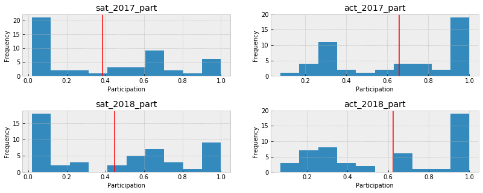

## General Assembly DSI 9 - Gabriel Perez Prieto

## Project 1 - Standardized Testing SAT / ACT

## Problem Statement

You are a Data Analyst for either the College Board (SAT) or the ACT. After performing your analysis, you must present your findings to your company's marketing team. Informed by this analysis, your recommendations should help the marketing team decide on a State where company should focus it's next campaign for state contracts.

Analyze data from the SAT and ACT from 2017 and 2018 as if you are part of the College Board (SAT) or the ACT. The data is organized by national average participation and scores on individual tests.

By analyzing the datasets I will come up with the best state to prepare a marketing campaign to improve scores and increase revenues for the College Board, the company that prepares the SAT.

The approach used to find the best suitable state for the task is to find states where the participation is significant for both tests, but with no evident preference for for either, do not have contracts with the SAT or ACT, and follow a downtrend from the previous years with the possibility to impact more people and improve scores.

My findings will be presented to a non-technical audience.

## Executive Summary

### Contents:
- [2017 Data Import & Cleaning](#Data-Import-and-Cleaning)
- [2018 Data Import and Cleaning](#2018-Data-Import-and-Cleaning)
- [Exploratory Data Analysis](#Exploratory-Data-Analysis)
- [Data Visualization](#Visualize-the-data)
- [Descriptive and Inferential Statistics](#Descriptive-and-Inferential-Statistics)
- [Outside Research](#Outside-Research)
- [Conclusions and Recommendations](#Conclusions-and-Recommendations)

## Data Dictionary
|Feature|Type|Dataset|Description|
|---|---|---|---|
|state|object|SAT|List of the all States in USA|
|sat_2017_part|float|SAT|Participation per State in the SAT exam|
|sat_2017_ebr|int|SAT|Average score for the Evidence-Based Reading and Writing section of the SAT exam|
|sat_2017_math|int|SAT|Average score for the Math section of the SAT exam|
|sat_2017_total|int|SAT|Average Total score for all sections of the SAT exam|
|state|object|ACT|List of the all States in USA|
|act_2017_part|float|ACT|Participation per State in the ACT exam|
|act_2017_english|float|ACT|Average score for the English section of the ACT exam|
|act_2017_math|float|ACT|Average score for the Math section of the ACT exam|
|act_2017_reading|float|ACT|Average score for the Reading section of the ACT exam|
|act_2017_science|float|ACT|Average score for the Science section of the ACT exam|
|act_2017_composite|float|ACT|Average Total score for all sections of the ACT exam|

## Distribution of Participation SAT / ACT

## Outside Research
States that require the SAT:
[https://blog.prepscholar.com/which-states-require-the-sat]

State that require the ACT:
[https://www.petersons.com/blog/states-requiring-the-act/]

Colorado:
The state had 100% participation in 2017 also had 100% participation in 2018. But out of the States with 100% participation in 2018, Colorado had a big rate change over the year as it signed to be an obligatory State for the SAT in 2018.
[https://www.testive.com/colorado-sat-change-2017/]

Georgia:
The state is in between regarding taking the SAT and ACT, but leaning towards the SAT for the last year compared with 2017, reducing its average participation in the ACT and increasing the SAT's.

Hawaii:
Interesting fact is that Hawaii had ~50% participation on the SAT for 2017 and 2018, but for the ACT the state had a low participation rate in 2017 and high participation in 2018, still with low scores, not following the trend of the lower the participation, the higher the scores are for a given exam.

## Conclusions and Recommendations
Strategy: Focus on states that are not fully with either SAT or ACT, regarding their 'preferred' exam.

Choice of State: Florida
Population = 21.3 Million | 3rd on the list of most populated states in the country [https://simple.wikipedia.org/wiki/List_of_U.S._states_by_population]

Florida's Participation 2017:
SAT = .83
ACT = .73

Florida's Participation 2018:
SAT = .56
ACT = .66

The participation rate for both tests decreased from 2017 to 2018 making the state one of the states that are in between taking the SAT or the ACT.

The state is the 3rd most populated state in the United States making it a great candidate for a targeted marketing campaign. Moreover Florida is the 5th state in total number of colleges in the United States.
[https://www.statista.com/statistics/306880/us-higher-education-institutions-by-state/]

Another benefit of choosing Florida is that it borders another state that is in between taking the SAT and the ACT: Georgia, and having an impact in Florida might induce an impact in Georgia's college systems.

Florida is scoring under the national average for the total SAT score and the composite ACT score. The campaign could reinforce the importance of the test to college students and institutions in order to get more people to take the test.
